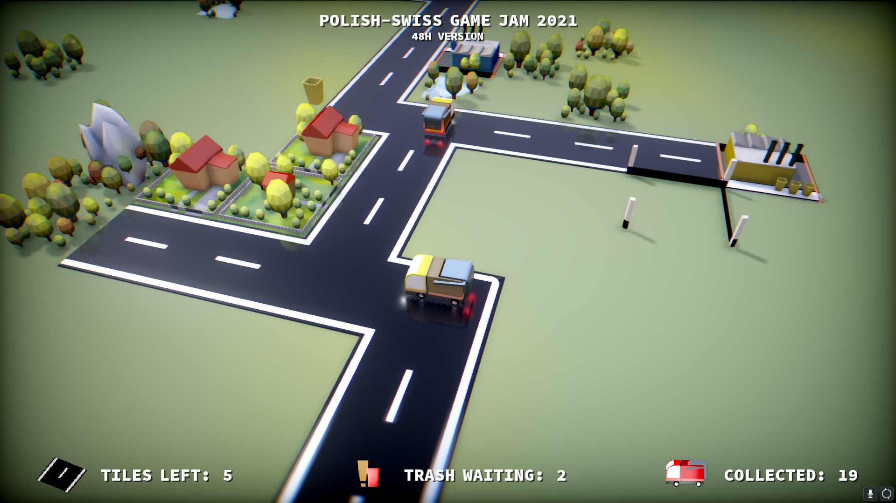

# GreenWay
## Polish-Swedish Game Jam 2021

A simple, zen like puzzle game. Design perfect recycling infrastructure.

- Connect houses with utilization centers.
- There are 4 different trash bin colour codes.
- Towns will grown over time. They need space to grow!
- Pay attention to the road tiles available to build (bottom-left)
- Too many un serviced trash ends the game
- Well working city with enough recicled material will mark a mission success

## Gamepad (recommended):

- [Thumbs] to move / rotate camera (rotation only in third camera mode)
- [SELECT] to change camera modes
- [A][B] build/remove road tile
- [X] [Y] show latest building/utilization center

## Mouse:

- [Left Mouse] to move and build road
- [Right Mouse] to remove road
- [F] to change camera

    
  [Showcase video](https://vimeo.com/637494275)
  [End gameplay video](https://vimeo.com/637632823)

Play the game here: https://w84death.itch.io/greenway // Windows / HTML5

Made with Godot and Blender
